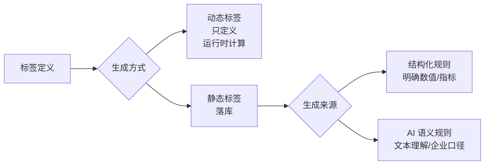
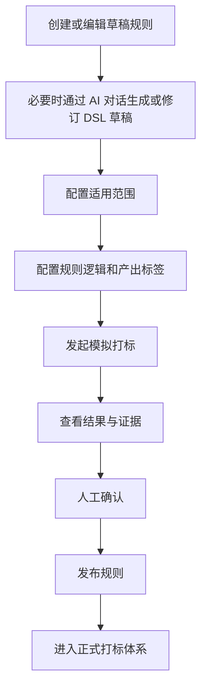

# 人才打标系统 PRD 重构版

## 1. 产品目标与范围

### 1.1 产品目标

建设一套以标签资产为核心、以规则治理为驱动、以结果证据追溯为保障的人才标签治理系统。

系统目标不是临时"打出一些标签"，而是建立一套稳定、统一、可治理的人才标签体系，保证：

- 标签口径统一
- 规则产出统一
- AI 与结构化规则共用同一套标签资产
- 标签按生成方式分为动态标签与静态标签；动态标签只定义不落库，静态标签用于沉淀可复用的业务结论
- 标签结果可解释、可追溯、可治理
- 标签、规则、结果的变更影响可控
- AI 能力贯穿规划、规则编写和执行全链路：规划智能体辅助生成标签方案，AI 对话辅助编写规则 DSL，AI 语义规则执行打标

### 1.2 为什么标签必须先定义，而不能随意生成

标签是系统里的标准化资产，而不是规则执行时临时拼接出来的字符串。

必须先定义标签，再让规则去引用和产出，原因如下：

- 避免同义标签泛滥，例如 `985`、`985院校`、`985高校`
- 保证结构化规则和 AI 语义规则都能复用同一套标签资产
- 保证结果统计、筛选、导出、权限控制都基于统一口径
- 保证标签可以被停用、迁移、合并和治理
- 保证历史结果和证据可以稳定追溯

因此，系统必须坚持以下原则：

- 标签必须先在标签定义中定义
- 规则和 AI 打标都只能产出已定义标签
- 不允许在规则运行时临时创建新标签

### 1.3 本期范围

本期覆盖：

- 标签类目治理
- 标签治理
- 标签迁移治理
- 打标规则治理
- 结构化规则打标（含 AI 对话辅助生成规则 DSL）
- AI 语义规则打标
- 模拟打标
- 正式打标（含重算）
- 标签结果查询
- 标签证据解释
- 规划智能体（根据业务场景自动生成标签类目、标签定义和打标规则方案）
- 权限管理（待定）

### 1.4 标签生成方式总览

标签按生成方式分为三类：

| 类型 | 说明 | 典型例子 | 是否长期落库 |
|---|---|---|---|
| 动态标签 | 只定义，不作为长期结果资产保存；运行时计算即可 | 年龄段、司龄段 | 否 |
| 静态标签-结构化规则 | 基于明确、可量化的条件配置产出 | 核心骨干、导师候选、管理后备 | 是 |
| 静态标签-AI 语义规则 | 基于语义理解、长文本抽取或企业特有口径产出 | 985、211、双一流、稳定性强、基层历练、专业方向、技术方向、行业背景 | 是 |



## 2. 核心对象定义

### 2.1 标签类目

标签类目用于对标签进行业务分类。

作用：

- 组织标签资产
- 为标签定义提供分类维度
- 为规则配置和结果查看提供归属视角

为什么需要标签类目：

- 标签类目不是为了展示分组，而是为了建立可治理的标签资产结构
- 没有类目时，标签会以离散集合存在，后续的查询、筛选、导出、权限控制和运营维护都会直接落到单标签层面，治理成本高
- 有了类目后，系统可以按业务域组织标签，保证标签资产长期可维护、可理解、可演进
- 类目为标签迁移、类目停用、类目合并等治理动作提供统一承载对象，避免在标签数量增长后逐条人工处理
- 类目为规则配置、结果查看、统计分析和权限设计提供稳定的归属维度，但不替代规则本身的判断逻辑
- 结构化规则和 AI 语义规则共享同一套标签资产时，类目有助于保持标签定义、引用和结果展示的一致口径


系统要求：

- 一个类目下可以有多个标签
- 同一个人同一类目下也允许有多个标签
- 类目只是分类容器，不做“单选”约束

### 2.2 标签

标签是系统中唯一合法的打标输出对象，是系统最核心的标准资产。

作用：

- 作为结构化规则和 AI 规则的统一输出目标
- 作为标签结果、筛选和统计的标准口径
- 作为治理、迁移、合并、停用的核心对象

系统要求：

- 标签必须先定义再被规则引用
- 一个标签当前只归属一个类目
- 标签可以迁移类目，但必须走治理流程

### 2.3 打标规则

打标规则是统一的打标能力对象，用于根据输入信息产出已定义标签。

规则分为两类：

- 条件打标规则（结构化规则）
- 智能打标规则（AI 语义规则）

两类规则共同要求：

- 都必须引用已定义标签，运行时不允许临时新建标签
- 都需要配置适用范围
- 都需要保留结果证据
- 都需要纳入修订、撤销发布和审计治理

编码与校验规则：

- 条件打标规则编码前缀为 `CR_`（Condition Rule）
- 智能打标规则编码前缀为 `AR_`（AI Rule）
- 新建规则时系统自动预填对应前缀，用户仅补充后缀
- 编辑场景下规则编码只读不可修改
- 规则编码在规则对象范围内全局唯一，不能重复
- 编码唯一性校验按不区分大小写处理
- 编码不符合前缀规范或命中重复时，阻断保存并给出明确提示

标签本身也分为两类：

- 动态标签：只定义，不长期落库；主要用于实时计算结果，例如年龄段、司龄段这类可直接由输入字段推导的标签
- 静态标签：需要打标落库；主要用于沉淀稳定、可复用、可筛选的业务结论，例如核心骨干、导师候选、管理后备、专业方向、技术方向、行业背景、985、稳定性强、基层历练
- 标签定义的创建与编辑展示只读状态字段，不引入草稿态；新增后默认进入启用状态，状态只在列表层维护

规则与标签的关系：

- 规则负责产生标签结果，不负责创建标签定义
- 确定数值和指标的条件，优先走结构化规则
- 需要语义理解、文本抽取或企业特有含义归纳的结果，优先走 AI 语义规则
- 年龄段、司龄段这类动态标签只做定义和运行时计算，不进入长期结果库

### 2.4 结构化规则

结构化规则根据明确、可量化条件进行判断，例如：

- 任职时长大于 3 年，输出标签 `核心骨干`
- 职级大于等于 P7，输出标签 `导师候选`
- 绩效为 A，输出标签 `管理后备`
- 年龄在 20 到 25，输出动态标签 `20-25`
- 司龄在 3 到 5 年，输出动态标签 `3-5`

编码规范：

- 结构化规则编码前缀为 `CR_`（Condition Rule）
- 新建时系统自动预填前缀，用户补充后缀
- 编码全局唯一，不区分大小写

结构化规则需要支持：

- 单值匹配
- 枚举匹配
- 区间映射

规则编辑采用左右分栏：

- 左侧：规则基本信息、DSL 编辑器和规则解释（由 DSL 自动生成）
- 右侧：AI 对话区，用户用自然语言描述规则目标和条件，AI 生成 DSL 草稿并同步到左侧编辑器
- AI 生成的 DSL 草稿必须经人工确认后才能保存
- 适用范围配置独立展示，不在分栏内

### 2.5 AI 语义规则

AI 语义规则根据文本语义理解进行打标，但本质上仍然属于打标规则的一种。

典型场景：

- 根据毕业院校识别 `211`、`985`、`QS20`
- 根据大段简历、经历、项目描述识别专业方向、技术方向、行业背景
- 根据企业内部口径识别 `稳定性强`、`基层历练` 这类企业特有标签

系统要求：

- AI 规则只能从已定义标签中选择输出
- 候选标签来源于语义规则配置文本的解析结果，不在新建/编辑弹窗中单独录入
- 一次执行允许输出多个标签
- 必须保留输入原文、候选标签和语义解释摘要
- 不能在运行时生成新标签；例如 `985` 必须先在标签定义中存在，再由 AI 选择输出

编码规范：

- AI 语义规则编码前缀为 `AR_`（AI Rule）
- 新建时系统自动预填前缀，用户补充后缀
- 编码全局唯一，不区分大小写

### 2.6 执行任务

执行任务负责运行规则并生成标签结果。

任务类型包括：

- 模拟打标任务（不写入正式结果，仅用于预演对比）
- 正式打标任务（执行并写入正式结果，含首次打标和重算；重算通过同一入口发起，选择"已发布但尚未重算"的规则即可）
- 标签迁移（仅治理标签归属，不触发打标计算）

#### 打标范围

模拟打标和正式打标任务均需配置打标范围，支持以下方式：

| 范围类型 | task_type | task_scope | 说明 |
|---------|-----------|------------|------|
| 全员 | FULL | null | 对所有在职员工执行打标 |
| 自定义 | CUSTOM | `{"orgIds":[...],"employeeIds":[...]}` | 按组织和/或员工选择 |

打标范围选择交互：

- 顶部提供"全员"勾选，勾选后跳过组织和员工选择
- 左侧为组织树（从 employee 表的 org_path 构建，最多 3 层），支持 checkbox 勾选整个组织
- 右侧为员工列表，点击左侧组织节点后加载该组织下的员工，支持按姓名/工号搜索，支持单独勾选员工
- 勾选组织 = 选中该组织下所有员工
- 底部汇总已选的组织数和员工数

### 2.7 标签结果

标签结果是规则运行后的派生产物，不是主数据。

它表示：

- 某个人当前有哪些标签
- 这些标签是由哪些规则、在什么任务下打出来的

### 2.8 结果证据

结果证据用于解释标签为什么产生。

结构化规则证据应包括：

- 来源规则
- 来源任务
- 命中字段
- 原始值
- 条件快照
- 适用范围快照

AI 规则证据应包括：

- 来源规则
- 来源任务
- 输入字段
- 输入原文
- 候选标签
- 语义解释摘要
- 最终输出标签

## 3. 对象关系与基本约束

### 3.1 对象关系

系统中的核心关系如下：

- 一个标签类目包含多个标签
- 一个标签当前归属于一个类目（不做系统强行限制，但是会提示该标签已经被其他规则引用）
- 一个标签可以被多条规则引用
- 一条规则可以产出多个标签
- 一个用户可以同时拥有多个标签
- 同一类目下，一个用户也允许同时拥有多个标签
  
### 3.2 基本约束

- 标签必须先定义，规则才能引用
- 规则和 AI 都不能临时生成新标签
- 类目只负责分类，不承担互斥裁决
- 标签结果是运行产物，不允许人工直接维护
- AI 语义规则与结构化规则属于同一类业务对象

## 4. 对象生命周期与治理规则

### 4.1 标签类目

允许操作：

- 新建
- 编辑
- 查看详情
- 查看所属标签
- 停用
- 删除
- 合并或迁移

类目编辑与停用的交互要求：

- 类目停用时，若类目下仍有启用标签，阻断停用并引导用户前往标签迁移页处理
- 标签迁移通过独立页面（标签迁移页）统一处理，支持双向迁移
- 迁移目标仅允许选择启用状态的类目，不能选择当前类目或停用类目
- 迁移只改变标签归属，不改变标签定义和历史结果

治理规则：

- 类目停用不能直接执行
- 停用前必须先迁移类目下标签，或先解除全部关联影响
- 如果类目下仍有启用标签，阻断停用
- 迁移时左右侧类目必须为启用状态
- 类目停用当前仅支持单条操作，暂不支持批量停用
- 类目删除仅在类目下无任何标签（包括启用和停用）时允许

编码与校验规则：

- 类目编码默认前缀为 `CAT_`
- 新建类目时系统自动预填前缀，用户仅补充后缀
- 类目编码在类目对象范围内全局唯一，不能重复
- 编码唯一性校验按不区分大小写处理
- 编码可以是数字，字母和常见符号
- 编辑场景下若编码未变更，不应被误判为重复
- 编码不符合前缀规范或命中重复时，阻断保存并给出明确提示

### 4.2 标签

允许操作：

- 新建
- 编辑
- 查看详情
- 修改所属类目
- 查看规则引用
- 查看结果引用
- 停用
- 删除
- 合并到其他标签

治理规则：

- 修改所属类目不是普通编辑，而是迁移操作
- 标签迁移统一支持三种场景：单标签迁移、批量标签迁移、类目清空迁移
- 标签迁移只修改标签归属关系（`tag.category_id`）
- 标签迁移不触发重算，不中断或重启正式打标
- 标签迁移不改写标签结果内容，仅影响按类目查看时的展示归属

标签删除规则：

- 标签在启用或停用状态下都允许删除，但必须同时满足删除前置条件
- 删除前置条件 1：没有被任何规则引用（结构化输出映射、DSL 引用均计入）
- 删除前置条件 2：没有任何历史打标结果/证据引用（employee_tag_result、employee_tag_result_detail）
- 任一前置条件不满足都必须阻断删除，并提示具体阻断原因

标签状态（启用/停用）的作用：

- 状态的唯一作用是控制标签是否出现在规则编辑的标签选择器中
- 启用的标签会出现在 `#` 触发的标签选择面板中，可被新规则引用
- 停用的标签不会出现在选择面板中，不会被新规则引用，但已有的 DSL 引用不受影响
- 典型场景：某个标签要逐步淘汰，不让新规则再引用它，但历史规则暂时保留——此时将标签"停用"即可

标签停用条件：

- 被任意规则引用的标签不能停用（无论规则是否已发布，只要 DSL 中引用了该标签就不可停用，避免规则引用失效标签）
- 没有规则引用的标签可以停用

编码与校验规则：

- 标签编码默认前缀为 `TAG_`
- 新建标签时系统自动预填前缀，用户仅补充后缀；编辑标签时编码只读不可修改
- 标签编码后缀仅允许 `A-Z`、`0-9`、`_`
- 标签编码后缀长度限制为 `2-60` 个字符
- 标签编码总长度限制为 `6-64` 个字符（包含前缀）
- 标签编码在标签对象范围内全局唯一，不能重复
- 编码唯一性校验按不区分大小写处理
- 编码不符合前缀规范、长度约束或命中重复时，阻断保存并给出明确提示

### 4.3 标签合并

为避免出现同义标签重复建设，系统应支持标签合并。

例如：

- `985`
- `985院校`
- `985高校`

合并规则：

- 源标签的规则引用迁移到目标标签
- 当前有效结果迁移到目标标签
- 历史结果统一归并到目标标签
- 源标签进入停用或归档状态

### 4.4 打标规则

#### 规则状态模型

规则采用双维度状态模型，两个维度各自独立：

| 维度 | 值 | 控制方 | 职责 |
|------|---|--------|------|
| 发布状态 | 未发布（UNPUBLISHED）/ 已发布（PUBLISHED） | 用户操作 | 决定规则是否参与正式打标 |
| 正式打标状态 | 未运行 / 运行成功 / 运行失败 | 系统自动 | 记录规则正式打标的执行结果 |

- 发布状态由用户通过"发布"和"撤销发布"操作切换
- 正式打标状态由系统根据正式打标任务的执行结果自动标记
- 未发布的规则没有正式打标状态，只有发布后才会产生

#### 为什么需要发布状态

发布状态的核心作用是区分"还在调试的规则"和"确认可以上生产的规则"，本质上是一个轻量的上线审批机制：

- 正式打标只能选已发布规则 → 防止未验证的规则进入生产，避免写了一半或还没模拟验证的规则被误选
- 已发布的规则不能编辑 → 保证生产规则的稳定性，要修改必须复制为新版本再编辑
- 撤销发布 → 规则退出生产，不再参与后续打标，但历史结果和证据保留（已被正式任务引用的规则不可撤销）
- 模拟打标不受发布状态限制 → 任何状态的规则都可以模拟验证

如果去掉发布状态，任何规则都能被正式打标选中（包括写了一半的），也没有机制阻止编辑一个正在被使用的规则，容易导致误操作和生产事故。

#### 各操作权限

| 操作 | 条件 | 说明 |
|------|------|------|
| 编辑 | 未被正式任务使用（运行中或已成功） | 规则未被任何正式打标任务运行成功或运行中时可自由编辑，无论发布状态。被正式任务使用的规则需先撤销相关任务后再编辑，或复制为新规则修订 |
| 删除 | 未被任何任务引用 | 被打标任务（模拟或正式）引用的规则不可删除，需先删除引用该规则的任务 |
| 发布 | 未发布 | 已发布的不需要重复发布 |
| 撤销发布 | 已发布 且 未被正式任务引用 | 撤销后规则不再参与正式打标，已被正式任务引用的规则不可撤销 |
| 复制 | 任意 | 打开新建弹窗，预填 DSL、规则解释等内容，编码和名称需重新填写 |
| 模拟打标 | 任意 | 模拟不影响正式打标状态，不写入正式结果 |

#### 状态组合

| 发布状态 | 业务含义 | 可编辑 | 可删除 |
|---------|---------|--------|--------|
| 未发布 | 新建草稿或已撤销发布，可自由编辑 | ✓ | ✓（未被任务引用时） |
| 已发布（未被正式任务使用） | 发布后未被正式任务运行成功或运行中 | ✓ | ✓（未被任务引用时，需先撤销发布） |
| 已发布（被正式任务使用） | 被正式任务运行成功或运行中 | ✗（需先撤销任务或复制为新规则） | ✗（被任务引用） |

#### 治理规则

- 编辑权限由正式任务使用情况决定：规则未被任何正式打标任务运行成功或运行中时可自由编辑（无论发布状态），被正式任务使用的规则需先撤销相关任务后再编辑
- 删除权限由任务引用情况决定：未被任何打标任务（模拟+正式）引用的规则可删除，被引用的规则需先删除相关任务
- 正式任务只能选已发布规则，撤销发布时会检查正式任务引用，因此未发布规则不存在被正式任务引用的情况
- 撤销发布时检查正式任务引用：已被正式任务引用的规则不可撤销，需先处理关联的正式任务
- 已发布但未被正式任务引用的规则，可先撤销发布再编辑或删除
- 已发布且被正式任务引用的规则，只能通过复制为新规则后修订
- 列表中显示「关联正式任务数」列，点击数字可查看关联的正式打标任务详情

### 4.5 已被引用规则修订治理

已被正式打标任务引用的规则不能原地修改。

允许方式：

- 复制为新规则（未发布、未运行）
- 新规则进入编辑
- 新规则验证通过后再发布

新规则发布后：

- 系统自动生成待重算记录
- 用户需要到正式打标页提交重算，可立即提交也可稍后提交

旧规则保留，用于：

- 审计
- 历史解释
- 结果回溯

### 4.6 撤销发布

已发布规则允许撤销发布，但有以下限制：

- 已被正式打标任务引用的规则不可撤销（需先处理关联的正式任务）
- 未被正式任务引用的已发布规则可以撤销，但必须强提醒

撤销发布后的影响：

- 该规则不再参与后续打标
- 由该规则产出的当前有效标签结果一并失效
- 历史结果和历史证据继续保留

### 4.7 标签结果

标签结果不允许人工直接编辑。

结果只能通过以下方式变化：

- 正式打标（含首次打标和重算）
- 标签合并
- 撤销发布规则
- 规则修订替换

## 5. 功能模块设计

系统按业务闭环分为 4 个导航组，共 8 个页面模块：

### 5.1 标签管理

对应导航组"标签管理"，包含 3 个页面：

- 标签类目（tag-categories）：类目的新建、编辑、查看、启用/停用、删除
- 标签定义（tags）：标签的新建、编辑、查看、启用/停用、删除
- 标签迁移（category-migration）：独立页面，左右双栏展示两个类目的标签列表，支持双向迁移

说明：标签合并治理和引用关系查询在本期原型中暂未独立成页，标签合并作为后续迭代补充。

### 5.2 规则与任务

对应导航组"规则与任务"，包含 4 个页面：

- 条件打标规则（rules）：结构化规则的新建、编辑、复制、发布、撤销发布、删除；列表展示发布状态和运行状态两列；编辑弹窗采用左右分栏，左侧维护 DSL 和规则解释，右侧提供 AI 对话生成草稿
- 智能打标规则（smart-tags）：AI 语义规则的新建、编辑、复制、发布、撤销发布、删除；列表展示发布状态和运行状态两列；配置输入字段、语义规则描述和候选标签
- 模拟打标（rule-publish）：新建模拟方案，选择打标范围和规则，运行后查看"当前结果 vs 模拟结果"对比，可下钻证据弹窗；模拟结果不写入正式数据
- 正式打标（recalc-tasks）：新建正式打标任务（含重算），选择打标范围和已发布规则，运行后查看结果对比和证据；运行成功后需提交才写入正式数据

### 5.3 规划与方案

对应导航组"规划与方案"，包含 1 个页面：

- 规划智能体（planning-agent）：根据业务场景、使用人群、痛点和现有数据，自动生成标签类目、标签定义和打标规则的完整方案；支持 3 个预设场景（管理类、技术类、校园类）；支持调用模型 API 增强生成质量；生成结果可导出为 Excel

### 5.4 审批与权限

对应导航组"审批与权限"，包含 2 个页面：

- 打标审批（approvals）：接收正式打标任务提交的审批，审批人可查看任务详情和关联规则，通过或驳回。通过后标签结果正式生效，驳回后需重新运行
- 权限管理（permissions）：角色列表、对象级权限矩阵、用户绑定与范围、权限治理规则展示

说明：标签结果查询和证据查看在本期通过模拟打标和正式打标的结果弹窗实现，暂未独立成页。操作日志与审计日志作为后续迭代补充。

## 6. 关键业务流程

### 6.1 标签定义并被规则引用

1. 管理员先创建标签类目
2. 在类目下定义标签
3. 规则管理员创建打标规则
4. 规则引用已有标签作为产出目标
5. 规则保存为草稿

### 6.2 规则发布流程

1. 创建或编辑草稿规则，必要时通过 AI 对话生成或修订 DSL 草稿
2. 配置适用范围
3. 配置规则逻辑和产出标签
4. 发起模拟打标
5. 查看结果与证据
6. 发布规则
7. 规则进入正式打标体系



### 6.3 正式打标与重算流程

1. 管理员选择已发布规则和执行范围
2. 系统生成正式打标任务
3. 任务运行规则并产出待确认结果
4. 管理员查看结果对比与证据
5. 管理员提交确认，状态从"待提交"变更为"已提交/已入库"
6. 提交后结果写入正式标签数据

说明：重算通过同一入口发起，选择"已发布但尚未重算"的规则即可，不需要独立的重算页面。

### 6.4 标签类目停用流程

1. 发起单条类目停用（当前修订不支持批量停用）
2. 系统做影响分析
3. 若类目下仍有启用标签，则阻断并直接跳转到统一标签迁移页
4. 管理员先完成标签迁移或引用解除
5. 再次发起类目停用
6. 类目进入停用状态

### 6.5 标签迁移流程

1. 进入统一标签迁移页，直接选择两侧类目并勾选标签执行双向迁移
2. 系统展示影响分析
3. 管理员确认移动
4. 标签归属切换到新类目
5. 不触发重算，不影响正式打标执行与结果内容；按类目查看时展示为新归属

### 6.6 规则撤销发布流程

1. 发起撤销发布
2. 系统强提醒撤销发布影响
3. 用户确认
4. 规则撤销发布
5. 该规则产出的当前有效结果失效
6. 历史证据保留

## 7. 数据与权限原则

### 7.1 数据原则

系统需要重点管理以下数据：

- 标签类目
- 标签
- 打标规则
- 任务
- 标签结果
- 结果证据
- 审计日志

数据原则：

- 资产对象与结果对象分层管理
- 结果对象不能绕过资产层独立存在
- 标签结果以 `tag_id` 为核心关联，类目归属通过标签主数据关系获取
- 所有关键对象都必须保留审计轨迹

### 7.2 权限原则

建议角色包括：

- 标签管理员
- 规则管理员
- 规则发布人
- 结果查看人
- 系统管理员

权限边界建议：

- 标签管理员负责类目和标签资产
- 规则管理员负责规则草稿和模拟打标
- 规则发布人负责规则发布和撤销发布
- 结果查看人负责结果和证据查询
- 系统管理员负责角色权限和全局治理动作

### 7.3 审计原则

系统必须保留以下审计信息：

- 标签变更记录
- 类目变更记录
- 规则修订记录
- 发布和撤销发布记录
- 任务执行记录
- 标签结果证据

## 8. MVP 与后续迭代

### 8.1 MVP 必须实现

- 标签类目
- 标签定义
- 标签迁移治理
- 打标规则管理（含 AI 对话辅助生成 DSL）
- 结构化规则打标
- AI 语义规则打标
- 模拟打标
- 正式打标（含重算）
- 标签结果查询（通过任务结果弹窗）
- 结果证据查询（通过证据弹窗）
- 规划智能体
- 权限管理
- 审计日志

### 8.2 后续迭代

- 标签合并治理
- 更复杂的规则表达能力
- 更丰富的 AI 证据结构
- 增量重算
- 跨系统同步
- 标签分析看板
- 标签消费侧（人才圈选、标签分布看板、员工标签画像）
- 独立的标签结果查询页和审计日志页

## 9. 数据变更感知与通知

### 9.1 背景与目标

员工数据由外部系统（HR 主数据、绩效系统等）通过实时同步或定时批量写入 employee 表。当员工发生晋升、绩效出炉、组织调整等变更时，系统应自动感知并判断哪些标签规则受到影响，生成变更通知，支持用户通过 AI 助手快速分析和处理。

目标：

- 自动感知员工数据变更，无需人工巡检
- 精确关联受影响的已发布规则（字段级匹配 + 作用域变更检测）
- 员工离职时自动失效所有标签
- 变更通知在系统全局可见（Header 铃铛 + AI 会话上下文）
- 支持从通知一键触发 AI 分析，AI 给出影响评估和处理建议

### 9.2 变更感知机制

#### 感知方式

采用 PostgreSQL 触发器（AFTER INSERT OR UPDATE ON employee），在数据库层面捕获所有写入，不依赖应用层入口。

原因：员工数据由外部系统直接写入，不经过本系统应用层，只能在数据库层面拦截。

#### 变更日志

触发器将每个变更字段写入 `employee_change_log` 表，每个变更字段一行记录：

| 字段 | 说明 |
|------|------|
| employee_id | 变更员工 ID |
| employee_no | 员工编号 |
| change_type | INSERT / UPDATE |
| field_code | 变更字段编码（如 grade_level、org_id） |
| old_value | 旧值 |
| new_value | 新值 |
| processed | 是否已被定时任务处理 |

监控字段范围：name、org_id、org_name、org_path、position_sequence_code、position_sequence_name、job_family_code、job_family_name、job_title、grade_level、birth_date、hire_date、education、university、resume_text、project_experience、employment_type、employee_status

#### 定时扫描

后端定时任务每 60 秒扫描未处理的变更日志，按员工分组后执行规则匹配和通知生成，处理完毕后标记日志为已处理。

### 9.3 规则影响匹配

定时任务对每个员工的变更执行三层匹配：

| 匹配层 | 匹配方式 | 示例 |
|--------|---------|------|
| 结构化规则条件 | 变更字段 ∩ tag_rule_condition.field_code | grade_level 变了 → 匹配所有用 grade_level 做条件的已发布规则 |
| AI 规则输入字段 | 变更字段 ∩ ai_rule_config.input_fields | resume_text 变了 → 匹配所有用 resume_text 做输入的 AI 规则 |
| 作用域变更 | org_id / position_sequence_code / job_family_code 变更时查 tag_rule_scope | org_id 变了 → 员工可能进入/离开某些规则的作用域 |

只匹配 status = PUBLISHED 的规则。

### 9.4 通知系统

#### 通知表（change_notification）

| 字段 | 说明 |
|------|------|
| employee_id / employee_no / employee_name | 变更员工信息 |
| change_type | INSERT / UPDATE / STATUS_CHANGE |
| change_summary | 人类可读摘要，如"张明(EMP001)的职级发生变更，影响 3 条规则" |
| changed_fields | JSONB，字段级变更详情 |
| affected_rules | JSONB，受影响规则列表（含规则名、类型、影响原因） |
| severity | INFO / WARN / CRITICAL |
| status | UNREAD / READ / DISMISSED / PROCESSED |

#### 严重级别规则

| 级别 | 触发条件 | 系统行为 |
|------|---------|---------|
| CRITICAL | employee_status 变为离职/失效 | 自动失效该员工所有有效标签，通知状态直接标记为 PROCESSED |
| WARN | org_id、position_sequence_code、job_family_code 变更 | 生成通知，等待用户处理 |
| INFO | 其他字段变更且匹配到规则 | 生成通知，等待用户处理 |

#### 员工离职特殊处理

当检测到 employee_status 变为 INACTIVE / RESIGNED / TERMINATED / DISMISSED 时：

- 直接执行 `UPDATE employee_tag_result SET valid_flag = FALSE WHERE employee_id = ? AND valid_flag = TRUE`
- 生成 CRITICAL 级别通知，通知状态为 PROCESSED（已自动处理）
- 通知仍在铃铛中展示，确保用户知晓

### 9.5 前端交互

#### Header 通知铃铛

- 位于 MainLayout Header 右侧，用户头像左边
- Badge 显示未读通知数，每 30 秒轮询刷新
- 点击展开 Popover 下拉面板，显示最近 10 条通知
- 每条通知显示：严重级别色标、变更摘要、时间、影响规则数
- 支持"全部已读"和单条"忽略"操作

#### 通知 → AI 分析联动

- 点击通知条目 → 标记已读 → 打开浮动 AI 面板 → 自动发送分析请求
- 发送内容：`请分析变更通知 #${id}：${changeSummary}`
- AI 调用 `analyzeChange` 工具，返回结构化影响分析
- AI 分析结果包括：受影响规则列表、每条规则当前标签状态、建议操作（创建计算任务 / 无需操作）
- 用户确认后，AI 可通过现有 `runTask` 工具创建计算任务

### 9.6 AI 工具：变更影响分析（analyzeChange）

| 属性 | 值 |
|------|---|
| 工具名 | analyzeChange |
| 类别 | ANALYSIS |
| 需确认 | 否 |
| 输入 | notificationId |

分析逻辑：

1. 加载通知详情和员工当前数据
2. 逐条分析受影响规则：是否在作用域内、条件是否可能变化、当前是否有标签结果
3. 返回 JSON 分析结果，包含：
   - 每条规则的影响评估和建议
   - 推荐操作：CREATE_TASK（建议创建计算任务）/ TAGS_INVALIDATED（已自动失效）/ NO_ACTION（无需操作）
   - 可直接用于创建任务的规则 ID 列表

该工具只做分析不做执行，执行需用户通过 AI 确认后调用现有的任务创建工具。

### 9.7 AI 会话上下文集成

每次 AI 对话时，system prompt 自动注入当前未读通知摘要：

- 未读通知总数
- 紧急通知数（CRITICAL）
- 提示 AI 可使用 analyzeChange 工具

使 AI 在对话中主动感知系统状态，用户无需手动告知。

### 9.8 calc_task 扩展

执行任务新增两个字段：

| 字段 | 说明 |
|------|------|
| trigger_type | MANUAL（手动创建）/ AUTO_CHANGE（由变更通知触发） |
| notification_id | 关联的变更通知 ID |

手动创建和自动触发的任务共用同一套执行引擎，仅来源不同。

### 9.9 规则执行引擎

#### 执行流程

打标任务运行时，由 CalcTaskExecutor 异步执行以下流程：

1. 获取任务关联的规则列表（通过 calc_task_rule）
2. 根据 taskScope 确定目标员工范围（全员 / 按组织 / 按员工）
3. 逐规则逐员工执行：
   - 解析规则的 dslContent（JSON DSL）
   - 解析字段引用 `@{字段名（field_code）}` 提取 field_code
   - 对员工数据逐条评估 conditions，按 logic（AND/OR）组合
   - 从 outputs 中提取标签编码 `#{标签名（TAG_CODE）}`
4. 写入结果：
   - employee_tag_result_detail：每个员工每条规则每个标签一条证据记录（HIT / REJECTED）
   - employee_tag_result：命中的写入标签结果
5. 更新任务状态为 SUCCESS 或 FAILED，记录 totalCount / successCount / failCount

#### 模拟打标 vs 正式打标

| 维度 | 模拟打标（SIMULATION） | 正式打标（FORMAL） |
|------|----------------------|-------------------|
| 规则要求 | 任意状态规则 | 仅已发布规则 |
| 标签结果 | validFlag = false（不影响正式数据） | validFlag = true（覆盖旧结果） |
| 旧结果处理 | 不处理 | 先将同员工同标签的旧有效结果置为 false |
| 提交 | 不需要 | 运行成功后需手动提交 |

#### AI 工具：执行打标任务（executeCalcTask）

| 属性 | 值 |
|------|---|
| 工具名 | executeCalcTask |
| 类别 | MUTATION |
| 需确认 | 是 |

支持三种操作：

- CREATE_AND_RUN：创建任务并立即运行（需指定 taskName、taskMode、ruleIds）
- RUN：运行已有的待运行任务（需指定 taskId）
- STATUS：查询任务运行状态和结果统计（需指定 taskId）

### 9.10 本期不包含

- 规则本身变更触发重算（规则发布/修改后的自动重算）
- 标签健康度监控（覆盖率、分布异常、过期标签占比）
- 企微/钉钉等外部渠道告警推送

## 10. AI 技能系统设计

### 10.1 设计理念

AI 技能（Skill）是 AI 助手的能力单元。每个技能描述 AI 能做什么、什么时候用，执行逻辑由后端 Java 代码承载。

核心原则：

- 技能用自然语言描述，不暴露 API 路径、HTTP 方法、JSON Schema 等技术细节
- 工作流由 LLM 自主推理串联，不预配置 workflow_steps
- 写操作自动走"准备→确认→执行"流程，用户确认后才实际执行
- 技能注册与执行通过 Spring AI FunctionCallback 原生集成

### 10.2 技能定义

每个技能包含以下属性：

| 属性 | 说明 |
|------|------|
| 技能编码 | 唯一标识，如 search_rules |
| 技能名称 | 显示名称，如 搜索打标规则 |
| 分类 | QUERY（查询）/ MUTATION（操作）/ ANALYSIS（分析）/ SYSTEM（系统） |
| 做什么 | 自然语言描述技能功能 |
| 什么时候用 | 自然语言描述使用时机 |
| 工具映射 | 对应的 Java FunctionCallback Bean 名 |
| 需要确认 | 写操作是否需要用户确认后执行 |
| 启用 | 是否参与 AI 对话 |

### 10.3 预置技能清单

#### 查询类

| 技能 | 说明 |
|------|------|
| 搜索打标规则 | 按关键词、状态、类型搜索规则 |
| 查看规则详情 | 获取规则完整配置（条件、输出标签、适用范围） |
| 搜索标签 | 按名称、编码、类目搜索标签定义 |
| 搜索员工 | 按姓名、职级、组织等搜索员工 |
| 搜索执行任务 | 按模式、状态搜索打标任务 |

#### 分析类

| 技能 | 说明 |
|------|------|
| 评估规则影响 | 评估规则修改后影响的员工数量和范围 |
| 标签统计分析 | 统计标签覆盖率和分布 |
| 生成规则条件 | 将自然语言转换为结构化 DSL |
| 变更影响分析 | 分析员工数据变更对规则的影响 |

#### 操作类（需确认）

| 技能 | 说明 |
|------|------|
| 修改打标规则 | 修改规则条件，已发布规则自动先复制再修改 |
| 创建打标规则 | 根据描述创建新规则 |
| 发布规则 | 将未发布规则发布生效 |
| 撤销发布规则 | 撤销已发布规则 |
| 复制规则 | 复制规则为新草稿版本 |
| 执行打标任务 | 运行打标任务 |
| 提交任务结果 | 提交正式任务结果入库 |

#### 系统类

| 技能 | 说明 |
|------|------|
| 确认执行操作 | 用户确认后实际执行待确认的操作 |

### 10.4 连续工作流

AI 助手支持在一次对话中自动串联多个技能完成复杂任务，无需用户手动操作多个页面。

典型场景："帮我把核心骨干的规则从 P7 调到 P8"

1. AI 调用搜索规则 → 定位"核心骨干"相关规则
2. AI 调用规则详情 → 查看当前条件配置
3. AI 调用评估影响 → 分析修改后影响范围
4. AI 调用修改规则 → 创建待确认操作（已发布规则自动先复制）
5. AI 展示修改计划和影响分析 → 等待用户确认
6. 用户确认 → AI 调用确认操作 → 实际执行
7. AI 调用搜索规则 → 验证修改结果

### 10.5 确认机制

所有 MUTATION 类技能执行时不直接修改数据，而是创建待确认操作（ai_pending_operation），包含：

- 操作描述（人类可读）
- 操作数据（JSON，用于回放执行）
- 影响摘要
- 30 分钟过期时间

用户通过 AI 对话确认或前端确认按钮触发实际执行。

### 10.6 技能管理页面

技能管理页面（/app/skill-management）提供技能的 CRUD 管理：

- 表格展示：技能名称、编码、分类、工具映射、需确认、启用状态
- 表单字段：技能编码、名称、分类、工具映射、做什么（描述）、什么时候用（使用时机）、需要确认、启用
- 支持按分类筛选和关键词搜索
- 支持启用/禁用切换

## 11. AI 对话交互设计

### 11.1 思考动画

AI 处理请求时显示思考动画，完整响应返回后一次性渲染格式化内容：

- 后端先发送 `event: thinking` 通知前端进入思考状态
- LLM 处理完成后发送 `event: content` 携带完整响应（JSON 编码确保单行传输）
- 前端思考状态显示旋转光球 + 流光文字 + 音频柱动画
- 收到完整内容后直接渲染 Markdown（表格、代码块、图表均正确格式化）

### 11.2 渐进式披露

AI 回复遵循分层输出策略：

- 第一层（默认）：摘要表格和核心数字
- 第二层（追问时）：展开详情
- 第三层（确认后）：执行写操作

### 11.3 图表可视化

AI 可在回复中嵌入图表，支持 pie、bar、line、radar、funnel 五种类型。

## 12. 系统导航与页面布局

### 12.1 顶部 Tab 导航

系统管理页面（MainLayout）顶部采用 Tab 导航：

- 点击左侧菜单打开页面时，自动在顶部生成对应 Tab
- Tab 显示页面标题，支持点击切换和关闭
- 关闭当前 Tab 自动跳转到最后一个 Tab
- 页面内不再重复显示标题

### 12.2 任务执行明细

模拟打标和正式打标页面的总数、成功、失败三列显示规则：

- 统计维度为规则级别：总数 = 任务包含的规则数，成功 = 所有员工都执行成功的规则数，失败 = 任何一个员工执行异常的规则数
- 待运行（INIT）状态：总数显示关联的规则数量，成功和失败显示 `-`
- 运行后（SUCCESS/FAILED/RUNNING）：总数、成功、失败显示实际执行数字，可点击弹出"规则执行明细"弹窗
- 弹窗顶部提供全部/成功/失败三个筛选 Tag
- 表格展示：规则名称、规则编码、规则类型、执行状态、命中人数
- 任何一条规则执行失败且没有成功的规则，整个任务状态为运行失败；有成功有失败则为运行成功

后端接口：`GET /calc-tasks/{id}/rules`

返回字段：

| 字段 | 说明 |
|------|------|
| ruleId | 规则 ID |
| ruleName | 规则名称 |
| ruleCode | 规则编码 |
| ruleType | 规则类型（STRUCTURED / AI_SEMANTIC） |
| status | 执行状态（SUCCESS / FAILED / PENDING） |
| hitCount | 命中人数（finalDecision=HIT 的记录数） |
| totalEvaluated | 总评估人数 |

### 12.3 规则选择器

模拟打标和正式打标新建/编辑任务时，规则选择采用弹窗表格勾选模式（非下拉选择），适应规则数量较多的场景：

- 点击"选择规则"按钮弹出独立弹窗
- 弹窗内为带分页、搜索、勾选的规则表格
- 支持跨页保持选中
- 选完后已选规则以 Tag 形式展示在表单中，每个 Tag 可单独删除
- 模拟打标：展示全部规则，表格含发布状态和运行状态列
- 正式打标：仅展示已发布规则，表格含版本号列

### 12.4 打标任务操作规则

#### 提交状态流转

正式打标任务的提交状态（submitStatus）：

```
PENDING（待提交）→ SUBMITTED（已提交）→ APPROVED（已审批）
                                      → REJECTED（已驳回）→ 重新运行 → PENDING
```

- 运行成功后可提交：PENDING → SUBMITTED
- 审批通过：SUBMITTED → APPROVED（标签结果 validFlag 置为 true，正式生效）
- 审批驳回：SUBMITTED → REJECTED
- 重新运行时自动清除提交状态：任何非 SUBMITTED 状态 → PENDING

#### 模拟打标操作矩阵

所有操作按钮始终显示，不可操作时灰色 + 悬浮 Tooltip 显示原因。

| 操作 | INIT | RUNNING | SUCCESS | FAILED |
|------|------|---------|---------|--------|
| 运行 | ✓ | ✗ 正在运行中 | ✓ 重新运行 | ✓ |
| 编辑 | ✓ | ✗ 运行中不可编辑 | ✗ 需先撤销 | ✓ |
| 查看结果 | ✗ 仅成功可查看 | ✗ 仅成功可查看 | ✓ | ✗ 仅成功可查看 |
| 撤销 | ✗ 仅成功可撤销 | ✗ 仅成功可撤销 | ✓ | ✗ 仅成功可撤销 |
| 复制 | ✓ | ✓ | ✓ | ✓ |
| 删除 | ✓ | ✗ 运行中不可删除 | ✗ 请先撤销 | ✓ |

#### 正式打标操作矩阵

操作分两排显示，所有按钮始终可见，不可操作时灰色 + Tooltip。

| 操作 | INIT | RUNNING | SUCCESS+PENDING | SUCCESS+SUBMITTED | SUCCESS+APPROVED | SUCCESS+REJECTED | FAILED |
|------|------|---------|-----------------|-------------------|------------------|------------------|--------|
| 运行 | ✓ | ✗ 运行中 | ✓ 重新运行 | ✗ 已提交 | ✗ 已审批 | ✓ 重新运行 | ✓ 重试 |
| 编辑 | ✓ | ✗ 运行中 | ✗ 需先撤销 | ✗ 已提交 | ✗ 已审批 | ✗ 需先撤销 | ✓ |
| 提交 | ✗ 仅成功可提交 | ✗ 仅成功可提交 | ✓ | ✗ 已提交 | ✗ 已审批 | ✗ 需重新运行 | ✗ 仅成功可提交 |
| 撤销 | ✗ 仅成功可撤销 | ✗ 仅成功可撤销 | ✓ | ✗ 已提交 | ✗ 已审批 | ✗ 需重新运行 | ✗ 仅成功可撤销 |
| 查看结果 | ✗ 仅成功可查看 | ✗ 仅成功可查看 | ✓ | ✓ | ✓ | ✓ | ✗ 仅成功可查看 |
| 删除 | ✓ | ✗ 运行中 | ✗ 请先撤销 | ✗ 已提交 | ✗ 已审批 | ✗ 请先撤销 | ✓ |

#### 重新运行逻辑

- 重新运行时自动清除：startTime、endTime、errorMessage、successCount、failCount
- 重新运行时 submitStatus 重置为 PENDING（清除已驳回等状态）
- 运行前自动清理该任务中关联规则的旧结果和证据，保证一条规则只有一套最新结果
- SUBMITTED 和 APPROVED 状态不允许重新运行

#### 撤销逻辑

- 前置条件：taskStatus=SUCCESS 且 submitStatus 不是 SUBMITTED/APPROVED
- 效果：删除该任务的所有标签结果和证据，taskStatus 重置为 INIT，submitStatus 重置为 PENDING
- 撤销后任务可重新编辑和运行

#### 编辑逻辑

| 条件 | 模拟打标 | 正式打标 |
|------|---------|---------|
| INIT | ✓ | ✓ |
| FAILED | ✓ 保存后重置为 INIT | ✓ 保存后重置为 INIT |
| RUNNING | ✗ | ✗ |
| SUCCESS | ✗ 需先撤销 | ✗ 需先撤销 |
| SUBMITTED | — | ✗ |
| APPROVED | — | ✗ |
| REJECTED | — | ✗ 需重新运行后再编辑 |

编辑保存后：更新规则关联（删除旧关联重新插入），总数更新为新的规则数量，成功和失败重置为 0，状态重置为 INIT，submitStatus 重置为 PENDING。

#### 删除逻辑

- 仅 INIT 和 FAILED 状态可删除
- RUNNING：提示"运行中不可删除"
- SUCCESS：提示"请先撤销后再删除"
- SUBMITTED / APPROVED：提示"已提交/已审批不可删除"
- REJECTED：提示"请先撤销后再删除"（虽然被驳回但结果数据还在）
- 删除时同时删除关联的 calc_task_rule 记录和标签结果/证据

#### 标签生效链路

```
运行成功（validFlag=false）
  → 提交（SUBMITTED，validFlag 仍为 false）
  → 审批通过（APPROVED，validFlag 置为 true，旧同标签结果失效）
  → 标签总览可见
```

标签结果只有审批通过后才在员工身上正式生效（validFlag=true），模拟打标和未审批的正式打标结果不会显示在标签总览中。

### 12.5 条件打标规则 DSL 规范

条件打标规则使用标准 JSON 格式的 DSL，可被程序直接解析执行。

#### DSL 结构

```json
{
  "conditions": [
    { "field": "grade_level", "op": "GE", "value": "P7" },
    { "field": "tenure_years", "op": "GT", "value": "3" }
  ],
  "logic": "AND",
  "outputs": ["#{核心骨干（TAG_CORE_BACKBONE）}"]
}
```

- `conditions`：条件数组，每个条件包含 field（字段）、op（运算符）、value（比较值）
- `logic`：条件组合逻辑，`AND`（所有条件都满足）或 `OR`（任一条件满足）
- `outputs`：命中后输出的标签，格式为 `#{标签名称（标签编码）}`

#### 支持的字段（field）

| field | 含义 | 值类型 |
|-------|------|--------|
| grade_level | 职级 | 字符串（P5/P6/P7...） |
| org_name | 组织名称 | 字符串 |
| position_sequence_code | 职位序列 | 字符串 |
| job_family_code | 职族 | 字符串 |
| job_title | 职务 | 字符串 |
| education | 学历 | 字符串 |
| university | 毕业院校 | 字符串 |
| employment_type | 用工类型 | 字符串 |
| employee_status | 员工状态 | 字符串 |
| hire_date | 入职日期 | 日期 yyyy-MM-dd |
| birth_date | 出生日期 | 日期 yyyy-MM-dd |
| tenure_years | 司龄（年，计算字段） | 数字 |
| age | 年龄（计算字段） | 数字 |

#### 支持的运算符（op）

| op | 含义 | value 格式 |
|----|------|-----------|
| EQ | 等于 | 单值 |
| NE | 不等于 | 单值 |
| GT | 大于 | 单值 |
| GE | 大于等于 | 单值 |
| LT | 小于 | 单值 |
| LE | 小于等于 | 单值 |
| IN | 在列表中 | 逗号分隔，如 `P7,P8,P9` |
| NOT_IN | 不在列表中 | 逗号分隔 |
| BETWEEN | 区间（含边界） | 逗号分隔两个值，如 `20,25` |
| LIKE | 模糊匹配 | 单值 |

#### 前端编辑交互

- 编辑弹窗左侧为结构化表单：字段下拉 + 运算符下拉 + 值输入 + 输出标签选择
- 条件可动态增删，逻辑组合（AND/OR）可切换
- 底部实时生成规则摘要（自然语言描述）
- 可展开查看原始 JSON
- 右侧 AI 对话区可用自然语言描述规则，AI 生成 JSON DSL 同步到左侧

#### 后端执行逻辑

1. 解析 dslContent 为 JSON 对象
2. 对每个目标员工，逐条评估 conditions
3. 按 logic（AND/OR）组合条件结果
4. 命中则从 outputs 提取标签编码，写入标签结果
5. 职级比较支持提取数字部分（如 P7 > P5）
6. tenure_years 和 age 为运行时计算字段

#### 智能打标规则标签引用

智能打标规则的语义规则描述中通过 `#{标签名称（标签编码）}` 格式引用标签：

- 引用格式：`#{标签名称（标签编码）}`，如 `#{985院校（TAG_985）}`
- 输入 `#` 弹出标签选择面板，支持搜索和分页
- 描述框下方实时显示引用的标签列表
- 列表页"输出标签"列从描述文本中自动解析显示

### 12.6 产品文档页面

系统左侧菜单"文档"分组下提供"产品文档"页面（/app/product-docs）：

- 左侧文档列表：从后端 `GET /docs` 接口加载项目 `doc/` 目录下所有 `.md` 文件
- 右侧阅读区：Markdown 渲染，标题分级（h1 28px、h2 22px、h3 17px），表格、代码块、引用块适配暗色主题
- 支持编辑：右上角编辑按钮切换到等宽字体编辑模式，保存直接写回磁盘文件
- 编辑/预览/保存切换时保持滚动位置
- Docker 部署时通过卷挂载 `./doc:/app/doc`，读写映射到宿主机文件

### 12.7 后端接口要求

任务规则明细接口：

| 接口 | 说明 |
|------|------|
| GET /calc-tasks/{id}/rules | 返回任务关联规则的执行明细 |

响应字段：

| 字段 | 类型 | 说明 |
|------|------|------|
| ruleId | Long | 规则 ID |
| ruleName | String | 规则名称 |
| ruleCode | String | 规则编码 |
| ruleType | String | STRUCTURED / AI_SEMANTIC |
| status | String | SUCCESS / FAILED |
| hitCount | Integer | 命中人数 |
| errorMessage | String | 失败时的错误信息 |

本系统的核心不是"规则怎么写"，而是"标签资产怎么治理"。

最终必须坚持以下原则：

- 标签必须先定义，不能随意生成
- 标签类目只负责分类，不做互斥约束
- AI 打标与结构化规则打标属于统一规则体系
- 所有规则都只能产出已定义标签
- 已发布的规则不可直接修改，只能在未被正式任务使用时编辑，或复制后修订
- 停用、迁移、删除都必须先处理影响对象；规则撤销发布需强提醒影响
- 结果只是资产运行产物，必须可解释、可审计、可治理

只有在这套领域模型稳定后，页面原型、数据库表结构、接口设计和研发实现才会一致。

## 附录B：接口数据要求（前后端对齐基准）

本附录明确各页面所依赖的接口响应字段要求，确保前后端实现一致。

### B.1 标签类目列表接口（GET /tag-categories）

响应字段要求：

| 字段 | 类型 | 说明 |
|---|---|---|
| id | Long | 主键 |
| categoryCode | String | 类目编码 |
| categoryName | String | 类目名称 |
| description | String | 说明 |
| status | String | 状态：ACTIVE / INACTIVE |
| tagCount | Integer | 该类目下的标签总数（动态统计，非持久化字段） |
| activeTagCount | Integer | 该类目下启用标签数（动态统计） |
| inactiveTagCount | Integer | 该类目下停用标签数（动态统计） |
| sortOrder | Integer | 排序 |
| createdBy | String | 创建人 |
| createdAt | DateTime | 创建时间 |
| updatedAt | DateTime | 更新时间 |

关键说明：

- `tagCount`、`activeTagCount`、`inactiveTagCount` 不是数据库字段，而是接口层通过关联 `tag_definition` 表按 `category_id` 聚合统计后返回
- 前端类目列表页的「标签数量」列显示"X 启用 Y 停用"格式；点击弹出标签列表弹窗（调用标签分页接口按 `categoryId` 过滤）
- 类目详情弹窗（点击类目名称）也依赖这些字段展示标签数量

### B.2 标签类目状态切换接口（PUT /tag-categories/{id}/status）

交互要求：

- 前端操作列必须提供「启用/停用」切换按钮
- 启用状态的类目显示「停用」操作（红色），停用状态的类目显示「启用」操作（绿色）
- 切换前需二次确认（Popconfirm）
- 停用时若类目下仍有启用标签，后端返回错误信息，前端展示提示并引导用户前往标签迁移页处理
- 启用操作无前置校验，直接切换

### B.3 标签类目详情交互要求

- 点击类目名称弹出详情弹窗，展示：类目名称、类目编码、说明、状态、标签数量、创建时间
- 详情弹窗内「标签数量」可点击，跳转到标签列表弹窗
- 详情弹窗提供「编辑」快捷入口

### B.4 标签列表弹窗交互要求

- 点击类目列表中的「标签数量」数字，弹出该类目下的标签列表弹窗
- 弹窗内标签列表支持分页（每页 10 条），避免标签数量过多时页面性能问题
- 弹窗标题显示类目名称和标签总数
- 标签列表展示字段：标签编码、标签名称、生成方式、状态、说明

### B.5 标签定义列表接口（GET /tag-definitions）

响应字段要求：

| 字段 | 类型 | 说明 |
|---|---|---|
| id | Long | 主键 |
| tagCode | String | 标签编码 |
| tagName | String | 标签名称 |
| categoryId | Long | 所属类目 ID |
| tagSource | String | 生成方式：DYNAMIC / STATIC_RULE / STATIC_AI |
| status | String | 状态：ACTIVE / INACTIVE |
| description | String | 说明 |
| createdAt | DateTime | 创建时间 |

### B.6 通用交互规范

- 所有列表页的操作列中，「删除」操作必须使用 Popconfirm 二次确认
- 所有「启用/停用」状态切换必须使用 Popconfirm 二次确认
- 状态标签统一使用 Tag 组件：ACTIVE 绿色显示「启用」，INACTIVE 灰色显示「停用」
- 所有列表页支持搜索和重置
- 编辑弹窗中编码字段在编辑模式下只读不可修改

### B.7 打标规则列表接口（GET /tag-rules）

#### 状态字段说明

规则采用双维度状态模型，接口必须同时返回两个独立状态字段：

| 字段 | 类型 | 值域 | 说明 |
|---|---|---|---|
| status | String | UNPUBLISHED / PUBLISHED | 发布状态，由用户通过「发布」和「撤销发布」操作切换 |
| runStatus | String | NOT_RUN / RUN_SUCCESS / RUN_FAILED | 正式运行状态，由系统根据正式打标任务执行结果自动标记 |

关键说明：

- 不存在「草稿」「已停用」等状态，旧的 DRAFT / STOPPED 状态已废弃
- `status` 字段控制规则是否参与正式打标
- `runStatus` 字段记录规则正式打标的执行结果
- 未发布的规则 runStatus 为空或不展示
- 两个维度各自独立，组合出多种业务含义（见 4.4 节）

#### 响应字段要求

| 字段 | 类型 | 说明 |
|---|---|---|
| id | Long | 主键 |
| ruleCode | String | 规则编码 |
| ruleName | String | 规则名称 |
| ruleType | String | 规则类型：STRUCTURED / AI_SEMANTIC |
| status | String | 发布状态：UNPUBLISHED / PUBLISHED |
| runStatus | String | 正式运行状态：NOT_RUN / RUN_SUCCESS / RUN_FAILED |
| priority | Integer | 优先级 |
| versionNo | Integer | 版本号 |
| dslContent | String | 规则 DSL 内容（结构化规则）或语义规则描述（AI 规则） |
| dslExplain | String | 规则解释 |
| createdAt | DateTime | 创建时间 |

#### 前端列表展示要求

- 列表必须同时展示「发布状态」和「运行状态」两列，不合并为单一状态列
- 发布状态：UNPUBLISHED 灰色显示「未发布」，PUBLISHED 绿色显示「已发布」
- 运行状态：NOT_RUN 灰色显示「未运行」，HAS_RUN 蓝色显示「已运行」

#### 操作按钮显示规则

| 操作 | 显示条件 | 交互要求 |
|---|---|---|
| 编辑 | runStatus = NOT_RUN 且未被正式任务运行成功或运行中 | 被正式任务使用的规则点击编辑时提示「该规则已被正式打标任务使用，请先撤销相关任务后再编辑，或复制后修订」 |
| 发布 | status = UNPUBLISHED | Modal.confirm 确认 |
| 撤销发布 | status = PUBLISHED | Modal.confirm 强提醒：撤销后规则不再参与打标，已产出的有效结果将失效 |
| 复制 | 任意状态 | 复制为新的 UNPUBLISHED + NOT_RUN 规则 |
| 删除 | 未被任何任务引用 | Modal.confirm 确认；被任务引用的规则删除时后端返回错误提示 |

#### 模拟打标规则选择器

- 模拟打标允许选择任意状态的规则（模拟不影响运行状态）
- 规则选择器中每条规则显示：规则类型 Tag + 规则名称 + 发布状态 Tag + 运行状态 Tag（仅已运行时显示）

#### 正式打标规则选择器

- 正式打标仅允许选择 status = PUBLISHED 的规则
- 接口查询时传入 `status=PUBLISHED` 过滤
- 规则选择器中每条规则显示：规则类型 Tag + 规则名称 + 版本号

## 附录A：原型页面操作清单（与当前原型一致）

### A.0 左侧菜单分组

当前原型左侧菜单按业务闭环分为 4 组：

- 标签管理：标签类目、标签定义、标签迁移
- 规则与任务：条件打标规则、智能打标规则、模拟打标、正式打标
- 规划与方案：规划智能体
- 审批与权限：打标审批、权限管理

分组原则：

- 同一业务链路放在同一组，减少跳转成本
- 保持"先资产、后规则执行、再规划方案、最后结果治理"的使用顺序

### A.1 标签类目（tag-categories.html）

支持操作：

- 查询（按名称/编码搜索）、按状态筛选（启用/停用）、重置
- 批量启用、批量导出
- 新建入口（批量区）与新建弹窗
- 新建类目弹窗默认预填编码前缀 `CAT_`
- 新建/编辑保存时执行类目编码唯一性校验（不可重复）
- 单条查看详情（点击类目名称）
- 单条查看所属标签（点击标签数量）
- 单条编辑（点击编辑）
- 单条状态切换（启用/停用）
- 单条删除（点击删除；类目下有标签时阻断）
- 若类目下仍有启用标签，停用时阻断并引导用户前往标签迁移页处理
- 编辑保存后回写列表字段（类目名称、类目编码、说明、状态）

### A.2 标签定义（tags.html）

支持操作：

- 查询（按名称/编码搜索）、按所属类目筛选、按状态筛选（启用/停用）、重置
- 批量启用、批量导出
- 新建入口（批量区）
- 单条查看详情（点击标签名称）
- 单条编辑（点击编辑）
- 单条状态切换（启用/停用）
- 单条删除（启用/停用均可触发删除；若存在规则引用或历史结果引用则阻断）
- 编辑字段包含标签名称、所属类目、描述、引用来源；标签编码在编辑时只读
- 创建与编辑弹窗展示只读状态字段；标签默认创建后即为启用，状态在列表层统一管理
- 标签编码前缀固定为 `TAG_`，后缀长度限制为 `2-60`，总长度限制为 `6-64`

### A.3 条件打标规则（rules.html）

支持操作：

- 查询（按名称/编码搜索）、按发布状态筛选（未发布/已发布）、重置
- 全选/多选规则
- 批量发布、批量撤销发布、批量复制、批量导出
- 列表展示"发布状态"列（未发布 / 已发布）和"正式打标状态"列（未运行 / 运行成功 / 运行失败），两个维度独立展示
- 未做模拟打标的规则发布时弹确认提醒
- 新建结构化规则（顶部/批量区），编码自动预填 `CR_` 前缀
- 单条查看详情（点击规则名称）
- 单条编辑（仅未运行的规则可编辑）
- 单条发布（仅未发布的规则可发布）
- 单条撤销发布（仅已发布的规则可撤销，需强提醒）
- 单条复制（任意状态均可，打开新建弹窗预填 DSL 和规则解释，编码和名称需重新填写）
- 单条删除（仅未运行的规则可删除）
- 编辑弹窗采用左右分栏：左侧维护规则基本信息、DSL 编辑器和规则解释；右侧提供 AI 对话区，用自然语言描述规则目标后 AI 生成 DSL 草稿并同步到左侧
- 适用范围配置在分栏下方独立展示

### A.4 智能打标规则（smart-tags.html）

支持操作：

- 查询（按名称/编码搜索）、按发布状态筛选（未发布/已发布）、重置
- 批量发布、批量撤销发布、批量导出
- 列表展示"发布状态"列（未发布 / 已发布）和"正式打标状态"列（未运行 / 运行成功 / 运行失败）；"已运行"可点击查看该规则的运行记录列表
- 新建（顶部/批量区），编码自动预填 `AR_` 前缀
- 单条查看详情（点击规则名称）
- 单条编辑（仅未运行的规则可编辑）
- 单条发布（仅未发布的规则可发布）
- 单条撤销发布（仅已发布的规则可撤销，需强提醒）
- 单条复制（任意状态均可，打开新建弹窗预填语义规则描述、输入字段和备注，编码和名称需重新填写）
- 单条删除（仅未运行的规则可删除）
- 单条查看打标结果（点击"查看"）
- 结果页按人员展示"当前标签 vs 本次智能标签"对比
- 结果页可下钻证据弹窗
- 编辑弹窗配置输入字段（下拉多选）、语义规则描述；候选标签由语义规则配置提取，弹窗不单独展示候选标签输入

### A.5 模拟打标（rule-publish.html）

支持操作：

- 查询（按方案名称/编号搜索）、按运行状态筛选（待运行/运行中/运行成功/运行失败）、重置
- 批量删除、批量导出
- 新建模拟方案（顶部/批量区）
- 单条查看方案详情（点击方案名称）
- 单条运行、复制、编辑
- 单条查看模拟结果
- 结果页按人员展示“当前结果 vs 模拟结果”对比
- 结果页可下钻证据弹窗
- 模拟方案编辑页可配置打标范围（全员或按组织/员工选择）、结构化规则、AI语义规则

说明：

- 模拟打标结果仅用于预演，不写入正式标签结果。

### A.6 正式打标（recalc-tasks.html）

支持操作：

- 查询（按任务名称/编号搜索）、按运行状态筛选（待运行/运行中/运行成功/运行失败）、重置
- 批量导出、批量重试
- 新建正式打标（顶部/批量区，配置打标范围和已发布规则）
- 单条查看任务详情（点击任务名称）
- 单条运行、停止、编辑、删除、重试、重跑
- 单条查看打标结果
- 结果页按人员展示“当前标签 vs 本次打标标签”对比
- 结果页可下钻证据弹窗
- 支持筛选“已发布但尚未重算”的规则，并在任务页发起重算
- 对运行成功任务执行“提交”后，状态从“待提交”变更为“已提交/已入库”

说明：

- 正式任务提交前仅生成待确认结果；提交后才进入正式数据。
- 正式打标为正式执行入口，只允许选择“已发布”状态规则；草稿规则仅可用于模拟打标，不可进入正式打标配置。

### A.7 打标审批（approvals.html）

支持操作：

- 查询（按任务名称/编号搜索）、按审批状态筛选（待审批/已通过/已驳回）、重置
- 列表展示正式打标任务的审批记录：任务名称、任务编号、运行状态、审批状态、执行统计、提交人、运行时间
- 单条查看详情（点击任务名称），展示任务信息和关联规则列表
- 待审批任务可执行"通过"或"驳回"操作
- 通过：标签结果正式生效
- 驳回：任务回到待提交状态，需重新运行

### A.8 权限控制（permissions.html）

支持操作：

- 导出权限矩阵
- 新建角色入口
- 查看角色列表
- 查看对象级权限矩阵
- 查看用户绑定与范围
- 查看权限治理规则

说明：

- 当前原型以权限展示和治理口径说明为主，后续再补充角色新增/编辑的交互细节。

### A.8 规划智能体（planning-agent.html）

支持操作：

- 左侧问卷区：配置业务场景（多选）、使用人群、当前业务痛点、附件上传、约束条件、现有数据
- 业务场景支持：人才筛选、人才对比、人岗匹配、人才评测、其他（可自定义）
- 3 个预设场景快速填充：管理类、技术类、校园类
- 点击"生成"后调用模型 API（`/api/planning-agent/analyze`）生成标签规划方案
- 模型不可用时自动降级为本地规则生成
- 生成结果自动导出为 Excel（2 个 Sheet：标签类目 + 类目标签字段）
- 草稿自动保存到 localStorage，支持历史快照恢复
- 重置按钮清空当前输入

说明：

- 规划智能体是 AI 辅助规划能力的入口，帮助用户从业务场景出发快速生成标签方案草稿，生成结果需人工确认后再进入标签类目和标签定义页正式录入。

### A.9 标签迁移（category-migration.html）

- 类目下拉仅展示状态为"启用"的类目；不可选择停用类目作为迁移两侧类目

支持操作：

- 左右双栏展示左侧类目与右侧类目的标签列表
- 选择左侧类目
- 选择右侧类目（仅可选择启用类目）
- 按标签关键词筛选两侧标签列表
- 支持左侧与右侧之间双向移动标签
- 填写迁移说明
- 执行移动任务（原型模拟）并返回类目页回写归属

说明：

- 该页面是统一的"类目间标签迁移"能力页；当从"类目停用"流程进入时，完成迁移后返回类目页继续停用校验。


